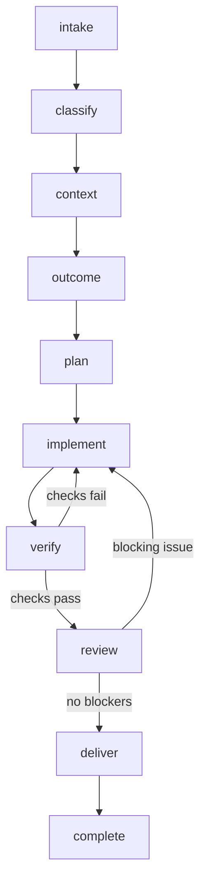
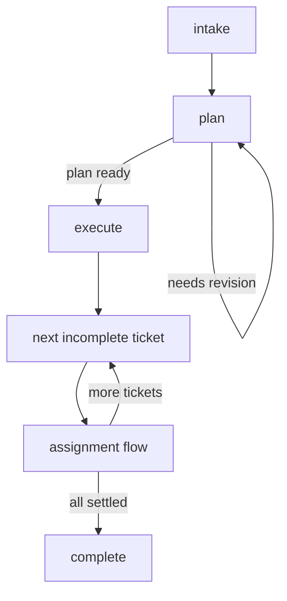

# Agent Graph

A portable software-engineering workflow for Claude Code, Codex, OpenCode, and other MCP-compatible coding agents.

The repository gives coding agents one repeatable process for handling assignments. Stages move forward in order; failed verification or a blocking review returns the assignment to `implement`. Multiple tickets can be grouped in a batch: plan the batch (with a planning loop), then run the same assignment flow sequentially on each ticket.

## Workflow

### Assignment



### Batch



Defined in `.agent/graph.yaml` and enforced by `src/workflow.ts` / `src/batch.ts`. The repository also includes:

- Shared operating instructions in `AGENTS.md`
- Project-scoped MCP configuration for Claude Code and Codex
- A TypeScript MCP server exposing assignment workflow and delegation tools
- An `agentctl` CLI for humans and agents
- Interchangeable Claude Code, Codex, and OpenCode worker adapters
- File-backed assignment and batch state under `.agent/state/`
- A declarative assignment/batch graph and task playbooks
- CI checks for TypeScript and workflow tests

## Requirements

- Node.js 20 or newer
- npm
- At least one supported worker CLI: `claude`, `codex`, `opencode`, or Antigravity's `agy`

## Setup

```bash
npm install
npm run check
npm test
```

Check which worker CLIs are available:

```bash
npm run agentctl -- providers
```

## Track an assignment

```bash
npm run agentctl -- start ENG-4521 --type feature --summary "Make the device picker resizable"
npm run agentctl -- criteria ENG-4521 "The picker can be resized"
npm run agentctl -- advance ENG-4521 context
npm run agentctl -- status ENG-4521
```

Record verification and delivery evidence:

```bash
npm run agentctl -- verify ENG-4521 tests passed --details "npm test"
npm run agentctl -- review ENG-4521 "Reviewed the final diff; no blocking issues found"
npm run agentctl -- deliver ENG-4521 "PR ready with tests and implementation summary"
```

## Track a batch of tickets

Group multiple assignments, plan them (loop on `plan` until ready), then work one ticket at a time:

```bash
npm run agentctl -- batch start SPRINT-12 \
  --summary "Ship picker and auth fixes" \
  --ids ENG-4521,ENG-4522,ENG-4523

npm run agentctl -- batch advance SPRINT-12 plan
npm run agentctl -- batch plan SPRINT-12 "Do auth first, then picker resize, then polish"
npm run agentctl -- batch note SPRINT-12 "ENG-4522 blocks picker tests"
npm run agentctl -- batch advance SPRINT-12 plan --note "Revised order after dependency check"
npm run agentctl -- batch advance SPRINT-12 execute

npm run agentctl -- batch next SPRINT-12
# Work that assignment through intake→complete, then:
npm run agentctl -- batch next SPRINT-12

npm run agentctl -- batch skip SPRINT-12 ENG-4523 --reason "Deferred to next sprint"
npm run agentctl -- batch advance SPRINT-12 complete
```

## Run an interchangeable worker

Every worker receives the same assignment context and records its result in `agentRuns`.

Claude Code:

```bash
npm run agentctl -- run ENG-4521 claude --cwd ../target-repository
```

Codex:

```bash
npm run agentctl -- run ENG-4521 codex --cwd ../target-repository
```

OpenCode:

```bash
npm run agentctl -- run ENG-4521 opencode --cwd ../target-repository
npm run agentctl -- run ENG-4521 antigravity --cwd ../target-repository
```

Choose a model or role at runtime:

```bash
npm run agentctl -- run ENG-4521 opencode \
  --cwd ../target-repository \
  --model <provider>/<model> \
  --agent build

npm run agentctl -- run ENG-4521 codex \
  --cwd ../target-repository \
  --mode review
```

Planning and review runs are read-only for Codex. Claude planning uses Claude Code's plan permission mode. No adapter enables unsafe permission bypass flags by default.

### OpenCode Go and OpenChamber

Configure OpenCode Go through OpenCode as usual, then pass the exact configured model identifier with `--model`.

To let Agent Graph and OpenChamber use the same OpenCode process, start a stable OpenCode server:

```bash
opencode serve --hostname 127.0.0.1 --port 4096
```

Point Agent Graph at it:

```bash
npm run agentctl -- run ENG-4521 opencode \
  --cwd ../target-repository \
  --attach http://127.0.0.1:4096 \
  --model <provider>/<model>
```

Configure OpenChamber to connect to that same server. Agent Graph submits and records the work, while OpenChamber remains the visual interface for the OpenCode session.

### Custom executable locations

Override a CLI command when it is not available under its default name:

```bash
export AGENT_GRAPH_CLAUDE_COMMAND=/custom/path/claude
export AGENT_GRAPH_CODEX_COMMAND=/custom/path/codex
export AGENT_GRAPH_OPENCODE_COMMAND=/custom/path/opencode
export AGENT_GRAPH_ANTIGRAVITY_COMMAND=/custom/path/agy
```

## Claude Code

The checked-in `.mcp.json` registers the local MCP server. After cloning:

1. Run `npm install`.
2. Open the repository in Claude Code.
3. Approve the project-scoped MCP server when prompted.
4. Ask Claude to start or inspect an assignment.
5. Ask Claude to delegate the assignment with `run_assignment_agent` when another worker is useful.

Example:

```text
Start assignment ENG-4521 as a bug fix. Define acceptance criteria, then delegate implementation to OpenCode and use Codex for an independent review.
```

## Codex

The checked-in `.codex/config.toml` registers the same local MCP server for trusted projects. After cloning and installing dependencies, open the repository with Codex and confirm the server with `/mcp` or `codex mcp list`.

## MCP tools

The server exposes:

- `start_assignment`
- `get_assignment`
- `list_assignments`
- `list_agent_providers`
- `run_assignment_agent`
- `advance_assignment`
- `add_acceptance_criterion`
- `add_assumption`
- `add_note`
- `record_verification`
- `record_review`
- `record_delivery`
- `start_batch`
- `get_batch`
- `list_batches`
- `advance_batch`
- `record_batch_plan`
- `add_batch_note`
- `get_batch_next`
- `skip_batch_assignment`

## Architecture

```text
Claude Code / Codex / OpenCode / OpenChamber
                   ↓
             Agent Graph MCP
                   ↓
     batch + assignment state machines
                   ↓
       provider-neutral runner
          ↙        ↓        ↘
      Claude     Codex    OpenCode
```

Agent Graph owns workflow state and evidence. The selected worker owns reasoning, file edits, and commands inside the target repository. Provider-specific CLI behavior is isolated under `src/agents/`, so the workflow does not depend directly on one vendor. When a batch is active, agents should plan the batch first, then run `run_assignment_agent` only on the current ticket from `get_batch_next`.

## Current scope

Version 0.2 is local and auditable. It can execute supported local worker CLIs, but it is not yet a durable remote LangGraph deployment. Natural next integrations are worktree isolation, GitHub pull-request automation, approval gates, mixed-provider role configuration, and an optional LangGraph runtime.

## License

MIT
